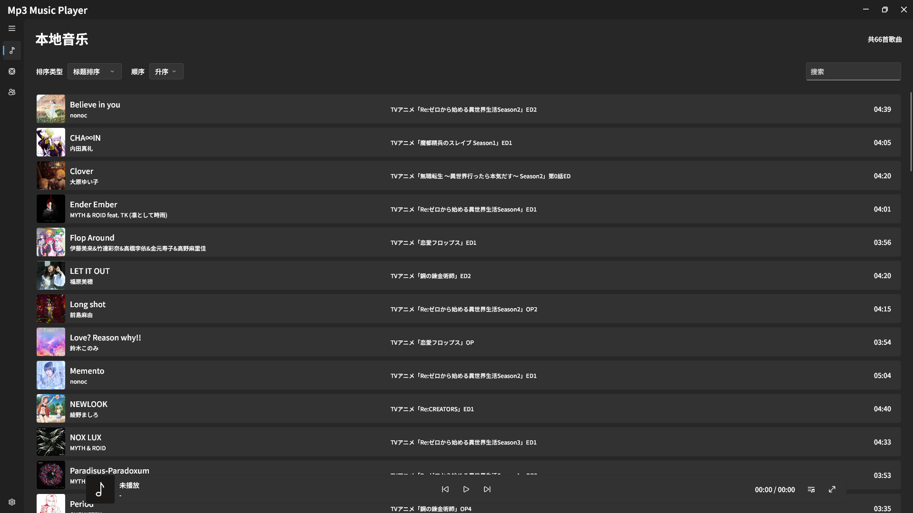

# Mp3 Music Player : 一款MP3本地音乐播放器

[ 项目框架 ] : 基于Flutter框架开发 
[  UI框架  ] : 基于FluentUI design设计开发 
[ 支持格式 ] : 仅Mp3格式 
[  元数据  ] : 仅支持内嵌元数据[歌曲标题, 歌曲艺术家, 歌曲副标题, 歌曲专辑等], 内嵌封面和内嵌Lrc歌词 

## 本地音乐页面

## 专辑及专辑详情页面
## 艺术家及艺术家详情页面
## 设置页面
## 播放器页面
